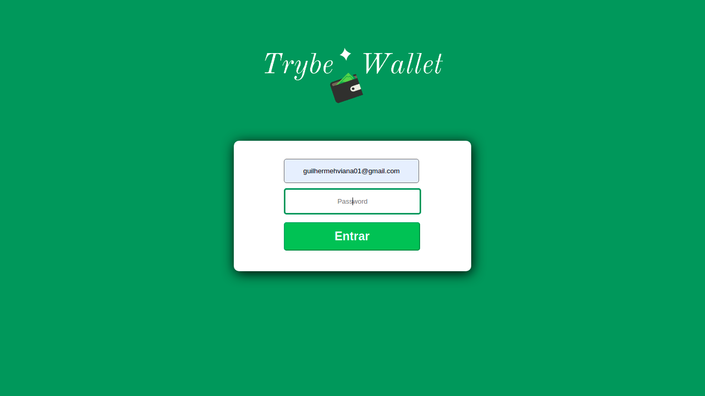
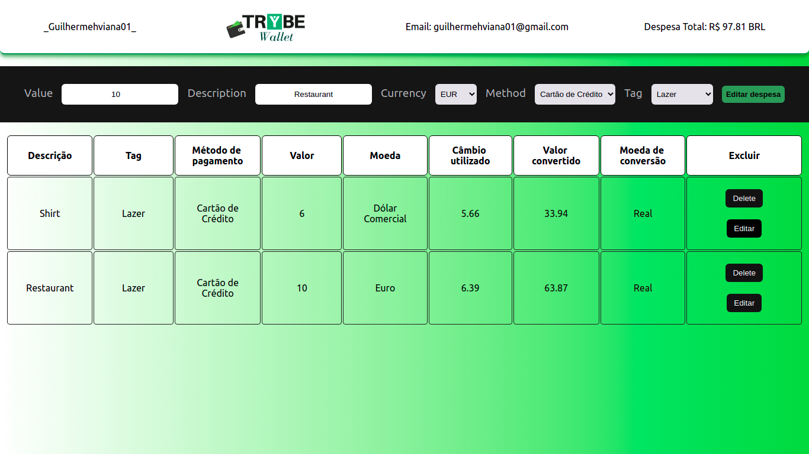

<h1 align="center"> Digital Wallet </h1>

 A digital wallet that registers, calculates and converts expenses in different currencies to a unique one.
   
  The user also can edit, remove and add new expenses in his wallet

  
  

## Techs used 

  <h2 align="center"> To run locally </h2>
  <ol>
  <li> Clone the repo with the command: <code> git clone git@github.com:guihtryb/trivia-game.git</code>.</li>
  <li> Enter in the <i>digital-wallet</i> directory and run <code>npm install</code> in your terminal to install the dependencies.</li> 
  <li> Run <code>npm start</code> and it will be opened on a new browser window.</li> 
  </ol>
